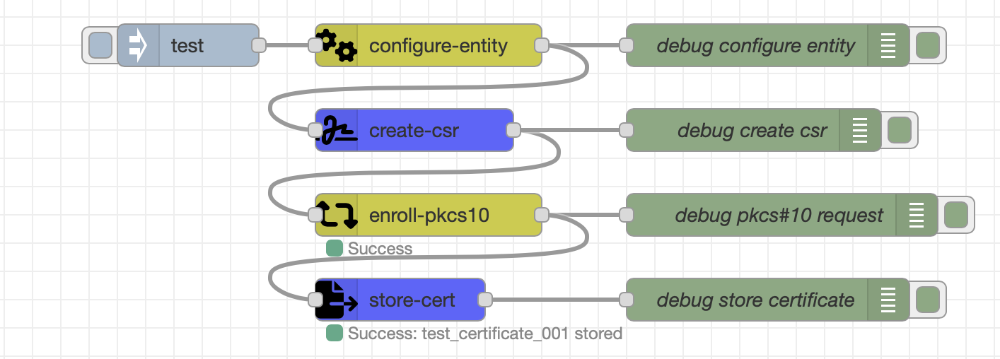

# node-red-contrib-pkcs11 

A simple layer for interacting with PKCS #11 / PKCS11 / CryptoKI in Node-Red

## Table of Contents

- [Installation](#installation)
- [Setting up SoftHSM](#setting-up-softhsm)
- [Nodes](#nodes)
- [Usage Examples](#usage-examples)
- [Contributing](#contributing)
- [License](#license)

## Setting up SoftHSM

[SoftHSM](https://www.opendnssec.org/softhsm/) is an implementation of a cryptographic store accessible through a PKCS #11 interface. You can use it to explore PKCS #11 without having a Hardware Security Module.

We will utilize SoftHSM because it is simple to setup and use and the underlying npm package ([Graphene](https://github.com/PeculiarVentures/graphene))

- For OSX see the [instructions here](https://github.com/opendnssec/SoftHSMv2/blob/develop/OSX-NOTES.md)
- For linux [instructions here](https://github.com/opendnssec/SoftHSMv2/blob/develop/README.md)

### pkcs11-tool

The [pkcs11-tool](https://linux.die.net/man/1/pkcs11-tool) is your best friend when it comes to debugging.

With the follwoing command you can list all objects on an HSM:
```
pkcs11-tool --module /usr/local/lib/softhsm/libsofthsm2.so --list-objects --slot-index 0 --pin 1234
```

## Installation

To install this Node-RED package, follow these steps:

1. Open your Node-RED instance.

2. Go to the menu on the top-right corner and select "Manage palette."

3. In the "Install" tab, search for "node-red-contrib-pkcs11" and click "Install" to add the package to your Node-RED
   instance.

4. After installation, restart Node-RED for the changes to take effect.

## Nodes

This package includes the following nodes:

* **p11-generate-key-pair**: Generates a RSA, EC or AES key-(pair) 
* **p11-info**: Lists the capabilities of the HSM
* **p11-create-csr**: Creates a CSR with a given key label
* **p11-sign**: Sign a given pyload with a key on the HSM
* **p11-verify**: Verifies the signature of a given payload with a key on the HSM
* **p11-digest**: Use a hash function to produce a hash value
* **p11-list-objects**: Lists all objects located on the HSM

## Usage Examples

To help you get started, here are some usage examples and workflows that demonstrate how to use the nodes in this
package. [Here](examples/pkcs11_flows.json) you can find a complete example of the Nodeset

### Example 1: Certificate Enrollment Workflow

The enrollment workflow utilizes [node-red-contrib-ejbca](https://github.com/FHatCSW/node-red-contrib-ejbca) to configure the CSR, enroll the certificate and store it on the local drive.



<details>
  <summary>Click to expand/collapse</summary>

```json
[
    {
        "id": "cfa94814c2fa89f2",
        "type": "configure-entity",
        "z": "6606d9de5049d44d",
        "name": "",
        "ejbcaConfig": "4eedf14773d23515",
        "CN": "test",
        "O": "Campus Schwarzwald",
        "OU": "Showcase Robot",
        "C": "DE",
        "L": "",
        "ST": "",
        "postalCode": "",
        "streetAdress": "",
        "serialNumber": "",
        "emailAdress": "",
        "givenName": "",
        "surName": "",
        "initials": "",
        "title": "",
        "description": "",
        "ipAddress1": "",
        "ipAddress2": "",
        "ipAddress3": "",
        "Uri1": "",
        "Uri2": "",
        "Uri3": "",
        "Dns1": "",
        "Dns2": "",
        "Dns3": "",
        "x": 420,
        "y": 60,
        "wires": [
            [
                "78b9ac55771e490b",
                "7e141a8475731b4b"
            ]
        ]
    },
    {
        "id": "0534fe27da275803",
        "type": "inject",
        "z": "6606d9de5049d44d",
        "name": "",
        "props": [
            {
                "p": "payload"
            }
        ],
        "repeat": "",
        "crontab": "",
        "once": false,
        "onceDelay": 0.1,
        "topic": "",
        "payload": "test",
        "payloadType": "str",
        "x": 250,
        "y": 60,
        "wires": [
            [
                "cfa94814c2fa89f2"
            ]
        ]
    },
    {
        "id": "78b9ac55771e490b",
        "type": "debug",
        "z": "6606d9de5049d44d",
        "name": "debug configure entity",
        "active": true,
        "tosidebar": true,
        "console": false,
        "tostatus": false,
        "complete": "true",
        "targetType": "full",
        "statusVal": "",
        "statusType": "auto",
        "x": 660,
        "y": 60,
        "wires": []
    },
    {
        "id": "0a97a5e70957471b",
        "type": "debug",
        "z": "6606d9de5049d44d",
        "name": "debug create csr",
        "active": true,
        "tosidebar": true,
        "console": false,
        "tostatus": false,
        "complete": "true",
        "targetType": "full",
        "statusVal": "",
        "statusType": "auto",
        "x": 650,
        "y": 120,
        "wires": []
    },
    {
        "id": "0f9a13f86ac05612",
        "type": "enroll-pkcs10",
        "z": "6606d9de5049d44d",
        "name": "",
        "tls": "7f5a2ba045b1a9b1",
        "ejbcaConfig": "4eedf14773d23515",
        "username_fieldType": "str",
        "username": "node_red_test_user_fhk",
        "csrInfo_fieldType": "msg",
        "csrInfo": "ejbca.csr",
        "enrollment_code": "foo123",
        "x": 420,
        "y": 180,
        "wires": [
            [
                "6565e43c510ece1c",
                "ad7da3cce58fed40"
            ]
        ]
    },
    {
        "id": "6565e43c510ece1c",
        "type": "debug",
        "z": "6606d9de5049d44d",
        "name": "debug pkcs#10 request",
        "active": true,
        "tosidebar": true,
        "console": false,
        "tostatus": false,
        "complete": "true",
        "targetType": "full",
        "statusVal": "",
        "statusType": "auto",
        "x": 670,
        "y": 180,
        "wires": []
    },
    {
        "id": "1976881b248836b2",
        "type": "debug",
        "z": "6606d9de5049d44d",
        "name": "debug store certificate",
        "active": true,
        "tosidebar": true,
        "console": false,
        "tostatus": false,
        "complete": "true",
        "targetType": "full",
        "statusVal": "",
        "statusType": "auto",
        "x": 660,
        "y": 240,
        "wires": []
    },
    {
        "id": "7e141a8475731b4b",
        "type": "p11-create-csr",
        "z": "6606d9de5049d44d",
        "name": "",
        "pkcs11Config": "35d840b7431fc17d",
        "subjectAltnames_fieldType": "msg",
        "subjectAltnames": "ejbca.subject_alternative_names",
        "subjects_fieldType": "msg",
        "subjects": "ejbca.subjects",
        "privateKeyLabel_fieldType": "str",
        "privateKeyLabel": "rsa_private_key_10",
        "publicKeyLabel_fieldType": "str",
        "publicKeyLabel": "rsa_public_key_10",
        "x": 410,
        "y": 120,
        "wires": [
            [
                "0f9a13f86ac05612",
                "0a97a5e70957471b"
            ]
        ]
    },
    {
        "id": "ad7da3cce58fed40",
        "type": "p11-store-cert",
        "z": "6606d9de5049d44d",
        "name": "",
        "pkcs11Config": "35d840b7431fc17d",
        "certificate_fieldType": "msg",
        "certificate": "ejbca.enroll_pkcs10.certificate",
        "certificateLabel_fieldType": "str",
        "certificateLabel": "test_certificate_001",
        "x": 400,
        "y": 240,
        "wires": [
            [
                "1976881b248836b2"
            ]
        ]
    },
    {
        "id": "4eedf14773d23515",
        "type": "ejbca-config-3",
        "name": "KF-CS-ShowcaseRobot-MQTT-Client-EndEntity",
        "ejbcaConf": "{\n    \"subjects\": [\n        {\n            \"property\": \"CN\",\n            \"prop_value\": \"\",\n            \"prop_required\": true,\n            \"prop_modifiable\": true\n        },\n        {\n            \"property\": \"O\",\n            \"prop_value\": \"Campus Schwarzwald\",\n            \"prop_required\": true,\n            \"prop_modifiable\": false\n        },\n        {\n            \"property\": \"OU\",\n            \"prop_value\": \"Showcase Robot\",\n            \"prop_required\": true,\n            \"prop_modifiable\": false\n        },\n        {\n            \"property\": \"C\",\n            \"prop_value\": \"DE\",\n            \"prop_required\": true,\n            \"prop_modifiable\": false\n        }\n    ],\n    \"subject_alternative_names\": [],\n    \"profile\": {\n        \"hostname\": \"campuspki.germanywestcentral.cloudapp.azure.com\",\n        \"certificate_profile_name\": \"KF-CS-ShowcaseRobot-MQTT-CertProfile\",\n        \"end_entity_profile_name\": \"KF-CS-ShowcaseRobot-MQTT-Client-EndEntity\",\n        \"certificate_authority_name\": \"KS-CS-ShowcaseRobot-MQTT-CA\",\n        \"username\": {\n            \"value\": \"\",\n            \"auto_generated\": false\n        },\n        \"enrollment_code\": {\n            \"required\": true,\n            \"auto_generated\": false,\n            \"minimum_bits\": 0\n        },\n        \"mail\": {\n            \"use\": true,\n            \"required\": false,\n            \"modifiable\": false\n        }\n    }\n}"
    },
    {
        "id": "7f5a2ba045b1a9b1",
        "type": "tls-config",
        "name": "",
        "cert": "",
        "key": "",
        "ca": "",
        "certname": "NodeRedRestAdmin001.cert.pem",
        "keyname": "NodeRedRestAdmin001.key.pem",
        "caname": "ca-chain.cert.pem",
        "servername": "",
        "verifyservercert": true,
        "alpnprotocol": ""
    },
    {
        "id": "35d840b7431fc17d",
        "type": "pkcs11-config",
        "name": "softhsm_local",
        "libraryPath": "/usr/local/lib/softhsm/libsofthsm2.so",
        "slot": "0",
        "password": "1234"
    }
]
```

</details>

### Example 2: Generate a RSA keypair


<details>
  <summary>Click to expand/collapse</summary>

```json
[
    {
        "id": "adeb25ea51a7a96f",
        "type": "debug",
        "z": "6606d9de5049d44d",
        "name": "debug generate key pair",
        "active": true,
        "tosidebar": true,
        "console": false,
        "tostatus": false,
        "complete": "true",
        "targetType": "full",
        "statusVal": "",
        "statusType": "auto",
        "x": 670,
        "y": 320,
        "wires": []
    },
    {
        "id": "01f25b30993f9b31",
        "type": "p11-generate-key-pair",
        "z": "6606d9de5049d44d",
        "name": "",
        "pkcs11Config": "35d840b7431fc17d",
        "keyType": "RSA",
        "bitLength": "2048",
        "curveType": "secp256r1",
        "aesBitlength": "256",
        "privateKeyLabel_fieldType": "str",
        "privateKeyLabel": "rsa_private_key_10",
        "publicKeyLabel_fieldType": "str",
        "publicKeyLabel": "rsa_public_key_10",
        "x": 430,
        "y": 320,
        "wires": [
            [
                "adeb25ea51a7a96f"
            ]
        ]
    },
    {
        "id": "41c14551f03af889",
        "type": "inject",
        "z": "6606d9de5049d44d",
        "name": "",
        "props": [
            {
                "p": "payload"
            }
        ],
        "repeat": "",
        "crontab": "",
        "once": false,
        "onceDelay": 0.1,
        "topic": "",
        "payload": "test",
        "payloadType": "str",
        "x": 230,
        "y": 320,
        "wires": [
            [
                "01f25b30993f9b31"
            ]
        ]
    },
    {
        "id": "35d840b7431fc17d",
        "type": "pkcs11-config",
        "name": "softhsm_local",
        "libraryPath": "/usr/local/lib/softhsm/libsofthsm2.so",
        "slot": "0",
        "password": "1234"
    }
]
```

</details>

### Example 3: Sign and Verify Data


<details>
  <summary>Click to expand/collapse</summary>

```json
[
    {
        "id": "8734394ab56dfa82",
        "type": "p11-sign",
        "z": "6606d9de5049d44d",
        "name": "",
        "pkcs11Config": "35d840b7431fc17d",
        "signAlgo": "SHA256_RSA_PKCS",
        "payload_fieldType": "msg",
        "payload": "payload",
        "privateKeyLabel_fieldType": "str",
        "privateKeyLabel": "rsa_private_key_10",
        "x": 390,
        "y": 640,
        "wires": [
            [
                "26d1305950102b1d",
                "a553c8de345a2548"
            ]
        ]
    },
    {
        "id": "9ca397a105c5e2e6",
        "type": "inject",
        "z": "6606d9de5049d44d",
        "name": "",
        "props": [
            {
                "p": "payload"
            }
        ],
        "repeat": "",
        "crontab": "",
        "once": false,
        "onceDelay": 0.1,
        "topic": "",
        "payload": "test",
        "payloadType": "str",
        "x": 230,
        "y": 640,
        "wires": [
            [
                "8734394ab56dfa82"
            ]
        ]
    },
    {
        "id": "26d1305950102b1d",
        "type": "debug",
        "z": "6606d9de5049d44d",
        "name": "debug sign",
        "active": true,
        "tosidebar": true,
        "console": false,
        "tostatus": false,
        "complete": "true",
        "targetType": "full",
        "statusVal": "",
        "statusType": "auto",
        "x": 630,
        "y": 640,
        "wires": []
    },
    {
        "id": "a553c8de345a2548",
        "type": "p11-verify",
        "z": "6606d9de5049d44d",
        "name": "",
        "pkcs11Config": "35d840b7431fc17d",
        "signAlgo": "SHA256_RSA_PKCS",
        "payload_fieldType": "msg",
        "payload": "payload",
        "signature_fieldType": "msg",
        "signature": "signature.buffer",
        "publicKeyLabel_fieldType": "str",
        "publicKeyLabel": "rsa_public_key_10",
        "x": 400,
        "y": 700,
        "wires": [
            [
                "61ffe1fd48aae8f8"
            ]
        ]
    },
    {
        "id": "61ffe1fd48aae8f8",
        "type": "debug",
        "z": "6606d9de5049d44d",
        "name": "debug verify",
        "active": true,
        "tosidebar": true,
        "console": false,
        "tostatus": false,
        "complete": "true",
        "targetType": "full",
        "statusVal": "",
        "statusType": "auto",
        "x": 630,
        "y": 700,
        "wires": []
    },
    {
        "id": "35d840b7431fc17d",
        "type": "pkcs11-config",
        "name": "softhsm_local",
        "libraryPath": "/usr/local/lib/softhsm/libsofthsm2.so",
        "slot": "0",
        "password": "1234"
    }
]
```

</details>

## Contributing

Contributions are welcome! If you would like to contribute to this project or report issues, please follow
our [Contributing Guidelines](/CONTRIBUTING.md).

## License

This Node-RED EJBCA Integration Package is licensed under the [MIT License](/LICENSE).

## Authors

**FHatCSW** - [GitHub Profile](https://github.com/FHatCSW)

**AlexCampusSchwarzwald** - [GitHub Profile](https://github.com/AlexCampusSchwarzwald)


